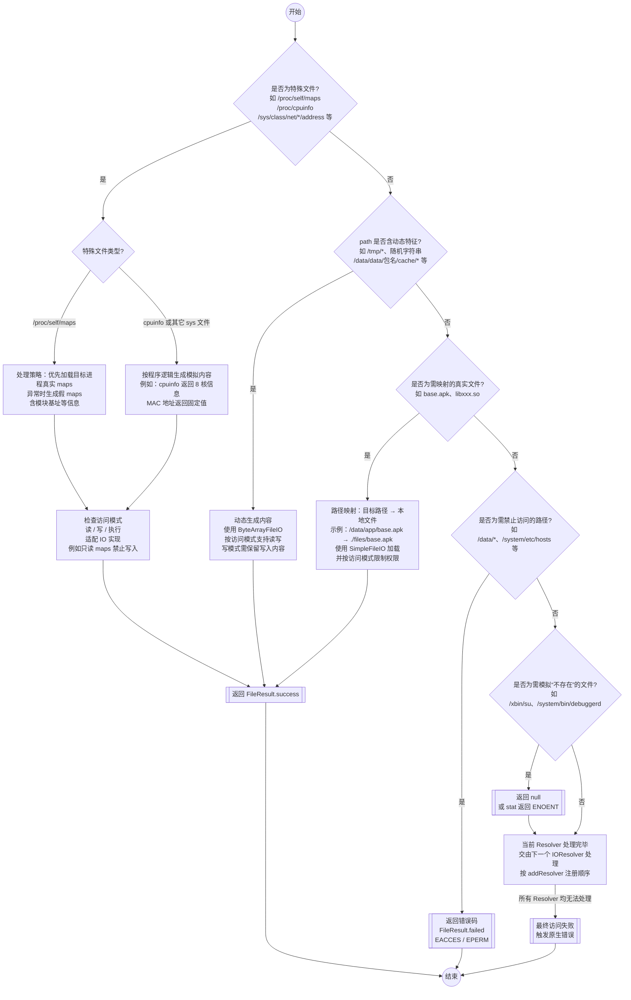

  
# 一、课程目标  
1. 理解文件访问补环境的 `IOResolver` 机制，并掌握不同 `FileIO` 的应用场景  
2. 掌握 `/proc/self/maps`、`/proc/self/status` 等关键文件的核心处理策略  
3. 理解补齐库函数的原理，掌握使用 `Dobby` Hook `__system_property_get` 等底层函数以伪造系统属性的方法  
  
# 二、工具  
  
1.教程 Demo  
2.IDEA  
3.IDA  
# 三、课程内容  
  
### 一. 补文件访问  
#### 一、文件访问补环境的核心概念  
文件访问 (File Access) 补环境是 Unidbg 应用中仅次于 JNI 补环境的重要环节。当 Unidbg 模拟执行的原生库（. So 文件）尝试通过文件 I/O 操作访问文件系统时——例如读取设备信息 (`/proc/cpuinfo`)、检测运行环境 (`/proc/self/maps`、`/xbin/su`) 或校验自身完整性 (APK 文件)——Unidbg 必须能够对这些访问请求作出响应。在一个纯净的 Unidbg 环境中，这些被访问的目标文件通常是不存在的。如果一个关键的文件访问失败或返回了不符合预期的内容，原生库可能会改变其执行逻辑、触发风控机制或直接中断执行。因此，文件访问补环境的目的就是通过 Unidbg 的 `IOResolver` 责任链机制拦截这些文件系统调用，并提供一个内容、权限都符合原生库逻辑预期的虚拟文件或目录。  
#### 二、核心机制：责任链模式与 `IOResolver`  
Unidbg 并未将所有文件处理逻辑写死，而是采用了一种灵活的**责任链模式**。当代码尝试访问一个文件时，请求会依次通过一个处理器链，直到被成功处理或最终失败。  
这个处理链的顺序通常是：  
1. **用户自定义的 `IOResolver`**：你添加的文件处理器，后添加的拥有更高优先级。  
2.  **`AndroidResolver`**：Unidbg 内置的默认处理器。  
3.  **虚拟文件系统（VFS）**：处理映射到文件系统的真实文件。  
这样的设计使得我们可以注入自定义逻辑来处理文件访问，而无需修改 Unidbg 源码，保证了项目的可移植性和环境的整洁性。  

`添加自定义文件处理器:`  
你可以通过 `emulator.getSyscallHandler().addIOResolver()` 来添加一个文件处理器。这个操作必须在加载 SO 库（loadLibrary）之前完成才能生效。  
```java  
// BiliIOResolver.java - 独立的处理器类  
public class BiliIOResolver implements IOResolver<AndroidFileIO> {  
    @Override  
    public FileResult<AndroidFileIO> resolve(Emulator<AndroidFileIO> emulator, String pathname, int oflags) {  
        // 打印所有文件访问请求，无论是否处理  
        System.out.println("File open request: " + pathname);  
        // 在这里添加具体的文件处理逻辑  
        return null; // 返回null表示未处理，交由下一个处理器  
    }  
}  
// Main.java - 在主类中添加处理器  
public class Bili extends AbstractJni {  
    public Bili() {  
        // ...模拟器初始化代码...  
        emulator.getSyscallHandler().addIOResolver(new BiliIOResolver());  
        // ...加载SO和后续操作...  
    }  
}  
```  
  
#### 三、文件处理的三种返回结果  
在 `resolve` 方法中，你可以返回一个 `FileResult` 对象，它有三种状态：  
1.  `FileResult.success(FileIO)`: 表示文件访问成功，返回一个 `FileIO` 对象。这是最常用的方式。  
2.  `FileResult.failed(errno)`: 表示文件访问失败，并返回一个指定的错误码，如 `UnixEmulator.EACCES` (权限不足)。  
3.  `FileResult.fallback()`: 表示回退，只有当其他所有处理器都无法处理时，才会由它来处理。  
#### 四、常规文件处理与 `FileIO` 对象  
处理文件访问需要结合三方面的知识：Linux/Android 文件系统知识、对业务（风控/检测）的经验以及 Unidbg 的实现方法。  
##### 1. 使用 `SimpleFileIO` 处理物理文件  
当需要返回一个真实存在的文件时，`SimpleFileIO` 是最佳选择。你需要将文件从真机上导出，并放置在你的项目路径下。  
**案例：补 `boot_id` 和 APK 文件**  
`boot_id` 常用于生成设备指纹，而 APK 文件访问常用于签名校验或资源读取，两者都必须处理。  
`boot_id` 文件在开机时生成，在设备关机前不会改变内容。我们将这个文件从真机上 push 出来  
```  
C:\Users\zhengji>adb shell  
* daemon not running; starting now at tcp:5037  
* daemon started successfully  
vermeer:/ $ cat /proc/sys/kernel/random/boot_id  
c7de54b2-f238-481d-b8e1-41c05413b2cd  
vermeer:/ $ cp /proc/sys/kernel/random/boot_id /sdcard  
vermeer:/ $ exit  
  
C:\Users\zhengji>adb pull /sdcard/boot_id D:\unidbg-master\unidbg-android\src\test\resources  
/sdcard/boot_id: 1 file pulled, 0 skipped. 0.0 MB/s (37 bytes in 0.012s)  
```  
  
  
```java  
@Override  
public FileResult<AndroidFileIO> resolve(Emulator<AndroidFileIO> emulator, String pathname, int oflags) {  
    switch (pathname) {  
        // 注意：这里的路径需要和样本访问的完全一致  
        case "/proc/sys/kernel/random/boot_id":{  
                return FileResult.<AndroidFileIO>success(new SimpleFileIO(oflags, new File("unidbg-android/src/test/resources/cpu/boot_id"), pathname));  
            }  
    }  
    return null;  
}  
```  
##### 2. 使用 `ByteArrayFileIO` 动态生成文件内容  
当文件内容需要动态生成或随机化时（例如躲避基于设备指纹的风控），`ByteArrayFileIO` 非常有用。它直接接收一个字节数组作为文件内容。  
**案例：随机化 `boot_id` 和补 CPU 频率**  
```java  
@Override  
public FileResult<AndroidFileIO> resolve(Emulator<AndroidFileIO> emulator, String pathname, int oflags) {  
    switch (pathname) {  
        case "/proc/sys/kernel/random/boot_id": {  
            // 动态生成UUID作为boot_id  
            String randomBootId = UUID.randomUUID().toString();  
            return FileResult.<AndroidFileIO>success(new ByteArrayFileIO(oflags, pathname, randomBootId.getBytes(StandardCharsets.UTF_8)));  
        }  
        case "/sys/devices/system/cpu/cpu0/cpufreq/cpuinfo_max_freq": {  
            // 直接返回一个字符串作为文件内容  
            return FileResult.<AndroidFileIO>success(new ByteArrayFileIO(oflags, pathname, "1766400".getBytes()));  
        }  
    }  
    return null;  
}  
```  
> **注意**：`ByteArrayFileIO` 不支持写入操作，如果样本需要写入文件，使用它会抛出 `UnsupportedOperationException`。  
##### 4. 使用 `DirectoryFileIO` 和虚拟文件系统处理目录  
  * **`DirectoryFileIO`**: 当样本明确访问一个目录时，可以使用它，并传入一个本地文件夹。  
  * **虚拟文件系统（VFS）**: 这是处理目录访问更好的选择。你可以在初始化模拟器时设置一个根目录，然后将需要的文件按真实路径结构放置其中。这对于样本需要遍历目录（如 `/system/fonts`）的场景非常高效。  
##### 4. 处理失败的文件访问  
多数情况下，对于环境检测类的文件（如 `su` 文件），我们什么都不做，让它自然失败即可。但在某些特殊场景，需要手动返回失败。  
**案例：模拟无 Root 权限**  
有些 Root 检测会尝试访问 `/data` 目录的权限。由于 Unidbg 的虚拟文件系统会自动创建 `/data` 目录导致访问成功，我们需要手动拦截并返回“权限不足”。  
```java  
@Override  
public FileResult<AndroidFileIO> resolve(Emulator<AndroidFileIO> emulator, String pathname, int oflags) {  
    if ("/data".equals(pathname)) {  
        return FileResult.failed(UnixEmulator.EACCES); // EACCES = 13, Permission denied  
    }  
    return null;  
}  
```  
#### 五、关键点  
  
|**文件路径 (Path)**|**主要用途 (Purpose)**|**推荐处理策略 (Recommended Strategy)**|**注意事项 (Key Points)**|  
|---|---|---|---|  
| `/proc/self/cmdline` |获取当前进程名|**必须补**。使用 `ByteArrayFileIO` 动态生成。|路径中的 `pid` 需用 `emulator.getPid()` 动态获取；内容末尾必须包含 `\0`。|  
| `/proc/self/status` |获取进程状态，检测 `TracerPid` |**必须补**。使用 `ByteArrayFileIO` 动态生成。| `TracerPid` 必须为 `0`；`Pid` 和 `Tgid` 字段应动态替换为 `emulator.getPid()`。|  
| `/proc/self/maps` |获取内存映射，检测 frida 等|**策略性处理**：  <br>1. **优先**：用真实 `maps` 文件 (`SimpleFileIO`)。<br>2. **备选**：若发生内存错误，则不处理，退回使用 Unidbg 默认的 `fakeMaps`。|真实 `maps` 可能导致内存地址访问异常；`fakeMaps` 缺少 APK等映射信息。|  
| `/data/app/.../base.apk` |签名校验、资源读取|**必须补**。使用 `SimpleFileIO` 提供真实的 APK 文件。|路径在不同设备上可能不同，注意日志中的实际访问路径。|  
| `/proc/sys/kernel/random/boot_id` |生成设备指纹|**建议补**。用 `SimpleFileIO` (固定) 或 `ByteArrayFileIO` (随机化)。|有些风控会记录 `boot_id`，随机化可避免关联。|  
| `/sys/.../cpuinfo_max_freq` |读取设备硬件信息|**建议补**。使用 `ByteArrayFileIO` 提供一个常见值。|直接返回一个字符串即可，如 "2867200"。|  
| `/xbin/su`, `/system/bin/su` |Root 环境检测|**无需处理或显式失败**。让其自然失败 (返回 `null`) 或通过 `stat` 返回 `ENOENT`。|不要提供一个假文件，让文件访问失败是最真实的无 Root模拟。|  
| `/proc/net/tcp`, `/proc/net/udp` |检测代理、抓包工具|**强烈建议不补**。|高版本 Android 已禁止访问。不补能模拟高版本系统行为，且避免暴露主机网络信息。|  
  
`/proc` 目录下的文件访问频率极高，且容易出错，需要特殊对待。  
##### 1. `/proc/self/cmdline`  
  * **用途**：获取当前进程名，常用于反调试或环境检测。  
  * **处理要点**：  
      * 必须补，否则可能导致关键逻辑失败。  
      * 由于进程 ID (pid) 每次运行都可能变化，硬编码 `/proc/12345/cmdline` 会失效。因此，**最佳实践是直接拦截符号链接路径 `/proc/self/cmdline`**，这样可以无需关心动态的 pid。  
      * 返回的进程名字符串末尾应包含一个 `\0` (NULL) 字符，这是 cmdline 的格式规范，不加的话在解析时存在出错的可能性。  
  *  
```java  
case "/proc/self/cmdline":  
    return FileResult.success(new ByteArrayFileIO(oflags, pathname, PACKAGE_NAME.getBytes()));  
```  
  
##### 2. `/proc/self/status`  
  * **用途**：获取进程状态，尤其是 `TracerPid` 字段，用于检测是否被调试（gdb/ida）。  
  * **处理要点**：  
      * 最简单的处理是只返回 `TracerPid: 0`。  
      * 更稳妥的方式是返回一个从真机 `status` 文件中复制的、内容完整模板。  
  *  
```java  
case "/proc/self/status":  
    // 返回一个包含 "TracerPid: 0" 的文件内容，表示未被调试  
    String statusContent = "Name:\t" + PACKAGE_NAME + "\n" +  
            "Umask:\t0077\n" +  
            "State:\tS (sleeping)\n" +  
            "Tgid:\t12345\n" +  
            "Pid:\t12345\n" +  
            "PPid:\t1\n" +  
            "TracerPid:\t0\n"; // 关键行  
    return FileResult.success(new ByteArrayFileIO(oflags, pathname, statusContent.getBytes()));  
```  
  
##### 3. `/proc/net/*` (tcp, udp, unix)  
  * **建议**：**一律不要补！**  
  * **原因**：  
    1.  Android 10 及以上版本已禁止普通应用访问此目录，不补文件符合高版本系统的行为。  
    2.  这些文件常用于检测网络代理、Frida/IDA 等工具的端口。如果从真机直接拷贝，可能会把这些危险信息带入模拟环境，反而导致检测失败。  
  
##### 4\. `/proc/self/maps` (重中之重)  
  
`maps` 文件记录了进程的内存映射，是所有文件访问中处理起来最复杂也最重要的一项。原生库通过读取它来检查环境中是否存在 Frida、Xposed 等 Hook 框架的特征模块，或者获取自身 APK 文件的路径以进行签名校验。  
  * **Unidbg 的默认处理 (`fakeMaps`)**：如果你不处理 `maps` 访问，Unidbg 会默认返回一个 `MapsFileIO` 对象。这个 `fakeMaps` 只包含当前加载的 SO 及其依赖库的内存信息，非常干净简洁。  
      * **优点**：可以完美绕过对 `frida-agent.so`, `xposed.so` 等风险模块的检测，因为 `fakeMaps` 中根本没有它们。  
  * **`fakeMaps` 的问题**：`fakeMaps` 是真实 `maps` 的一个**子集**。它缺少很多信息，例如：  
      * 缺少 APK 文件的映射，导致基于 `maps` 寻找 APK 路径并进行签名校验的逻辑失败。  
      * 缺少其他 SDK 或系统库的映射，导致检测特定 SDK 是否加载的逻辑失败。  
  * **真实 `maps` 的问题**：直接使用从真机导出的 `maps` 文件虽然能解决上述问题，但会引入新的、更严重的问题。如果样本解析 `maps` 文件获取内存地址并尝试读取该地址的内容（如进行 inline hook 检测、扫描内存特征），将会导致 Unidbg 崩溃。因为真实 `maps` 中的内存地址在 Unidbg 的模拟环境中绝大部分是不存在的。这无异于“**拿着北京的地图在南京开车**”。  
  
**处理 `maps` 的三种核心策略:**  
面对 `maps` 的复杂性，理论上的最佳方案是完全逆向分析其所有检测点，然后构造一份完美的 `maps` 文件。但在实践中，我们可以采用以下三种更高效的策略，并根据情况灵活选择。  
###### 策略一：使用 Unidbg 默认 `fakeMaps`  
  * **做法**：在你的 `IOResolver` 中不添加任何对 `/proc/self/maps` 的处理逻辑。  
  * **优点**：最简单，能绕过所有基于 `maps` 内容的风险模块（Frida 等）检测。  
  * **缺点**：缺少 APK 等关键路径信息，如果 App 会校验 `maps` 中的 APK 路径，此方法会失效。  
  * **适用场景**：  
    1.  确定 App 的 `maps` 检测逻辑比较简单，不关心 APK 路径。  
    2.  当其他策略导致未知错误时，退回此策略作为保底方案。  
  
###### 策略二：使用真实 `maps` 文件  
  * **做法**：从与你模拟环境相近的真机上，抓取目标 App 运行时的 `maps` 文件 (`cat /proc/<pid>/maps`)，并用 `SimpleFileIO` 返回它。  
  * **优点**：信息最全，能够应对需要检查各种库（如特定 SDK）是否加载的场景。  
  * **缺点**：**风险极高**。一旦 App 根据 `maps` 中的地址去读取内存，几乎必然导致 Unidbg 因访问非法地址而崩溃。  
  * **适用场景**：  
    1.  作为一种快速试探手段，当你怀疑 App 仅仅是简单地搜索 `maps` 文件中的某些字符串，而不会进行后续的内存操作时。  
    2.  **出现内存异常时，必须立即切换**：如果在使用了真实 `maps` 后，程序执行中出现内存访问异常（Bad Address, segmentation fault 等），应立刻放弃此策略。  
  
###### 策略三：按需构造极简 `maps` 内容  
  * **核心思想**：**“它要什么，就给什么”**。通过日志或简单逆向，分析出 App 访问 `maps` 文件的真实意图，然后用 `ByteArrayFileIO` 动态构造一个只包含它所关心的那几行内容的 `maps` 字符串。  
  * **做法**：假设我们分析出 App 读取 `maps` 只是为了找到 `base.apk` 的路径，那么我们的处理如下：  
    ```java  
    // 在 IOResolver 的 resolve 方法中  
    case "/proc/self/maps": {  
	    final String APK_PATH = "/data/app/com.zj.wuaipojie-1/base.apk";  
	    String maps = "7fbe852000-7fbe853000 r-xp 00000000 00:00 0 " + APK_PATH + "\n";  
	    return FileResult.success(new ByteArrayFileIO(oflags, pathname, maps.getBytes(StandardCharsets.UTF_8)));  
}  
    ```  
  * **优点**：  
      * **精准绕过**：提供了 App 关心的 APK 路径，成功绕过校验。  
      * **安全无风险**：由于没有提供任何真实的内存地址，从根本上杜绝了 App 进行非法内存读写导致崩溃的可能。  
      * **环境干净**：`maps` 内容完全由我们控制，干净且不含任何风险模块特征。  
  * **适用场景**：绝大多数需要处理 `maps` 的情况。它只需要很小的分析成本，就能获得稳定且安全的结果。  
  
### 二. 补库函数  
#### 1. 什么是“库函数”？  
  
首先，一个应用程序（例如一个 App 的 `.so` 文件）通常不会自己从零开始实现所有功能。它会依赖大量由操作系统或第三方提供的**共享库（Shared Libraries）**，在 Android/Linux 中，这些库通常是 `.so` 文件（Shared Object）。  
**库函数**就是这些共享库中提供的、可供应用程序调用的、预先编译好的函数。  
- **例子**：  
    - `libc.so` (C 标准库): 提供了 `fopen` (打开文件), `printf` (打印字符串), `malloc` (分配内存), `gettid` (获取线程 ID) 等基础功能。  
    - `liblog.so` (安卓日志库): 提供了 `__android_log_print` (打印 logcat) 功能。  
    - `libz.so` (压缩库): 提供了 `compress`, `uncompress` 等数据压缩功能。  
  
当你的 so 文件调用 `fopen` 时，它实际上是在请求操作系统加载 `libc.so`，并执行其中的 `fopen` 函数代码。  
  
#### 2. 案例讲解  
**案例 1：补 getProperty**  
**`__system_property_get` 函数详解**  
在 Android 系统中，App 获取设备信息（如型号、品牌、系统版本等）最常用、最底层的手段之一就是调用 `libc.so` 库中的 `__system_property_get` 函数。理解并控制这个函数，是 Unidbg 环境模拟的重中之重。  
 **1. 它是做什么的？**  
`__system_property_get` 是一个 C 函数，原型如下：  
```C  
int __system_property_get(const char* name, char* value);  
```  
- **功能**：根据传入的属性**名称**（`name`，一个字符串，例如 `"ro.product.model"`），查询对应的属性**值**，并将结果存入调用者提供的内存缓冲区（`value`）。  
- **返回值**：  
    - 如果成功找到属性，函数返回属性值的**长度**。  
    - 如果属性不存在，函数返回 `0`。  
当一个 App 的 Java 代码调用 `android.os.SystemProperties.get("ro.product.model")` 时，其底层最终就会调用到这个 Native 函数来完成查询。  
**2. 为什么它在补环境中如此重要？**  
几乎所有的风控和反调试检测都会利用这个函数来“审问”当前的运行环境。它们会查询一系列的属性，来判断设备是否真实、是否被 Root、是否处于调试状态。常见的检测点包括：  
- **设备标识**：`ro.product.model`, `ro.product.brand`, `ro.build.fingerprint`  
- **硬件信息**：`ro.board.platform`, `ro.hardware`  
- **调试状态**：`ro.debuggable` (值应为 `0`), `ro.secure` (值应为 `1`)  
- **ABI/CPU 类型**：`ro.product.cpu.abi`  
如果不对这个函数进行处理，Unidbg 环境下的默认返回值可能为空或不符合预期，导致 App 识别出模拟器环境，从而触发风控或直接退出。  
**3. 修补方法**  
```java  
// 方式1：使用unidbg自带类 SystemPropertyHook  
SystemPropertyHook systemPropertyHook = new SystemPropertyHook(emulator);  
systemPropertyHook.setPropertyProvider(new SystemPropertyProvider() {  
    @Override  
    public String getProperty(String key) {  
        // 在这里根据请求的key，返回伪造的value  
        switch (key){  
            case "ro.board.platform": {  
                return "kalama";  
            }  
            case "ro.product.model": {  
                return "23113RKC6C";  
            }  
        }  
        // 如果返回null，则会尝试使用Unidbg的默认属性  
        return null;  
    }  
});  
// 将Hook注册到内存中  
memory.addHookListener(systemPropertyHook);  
  
  
// 方式2：使用Dobby直接Hook原生C函数  
private void hookSystemPropertyGet() {  
    Module libc = emulator.getMemory().findModule("libc.so");  
    Symbol propertyGetSymbol = libc.findSymbolByName("__system_property_get");  
  
    Dobby dobby = Dobby.getInstance(emulator);  
    dobby.replace(propertyGetSymbol, new ReplaceCallback() {  
        @Override  
        public HookStatus onCall(Emulator<?> emulator, HookContext context, long originFunction) {  
            // C函数原型: int __system_property_get(const char *key, char *value);  
            // 手动从寄存器获取参数指针  
            UnidbgPointer keyPtr = context.getPointerArg(0);  
            UnidbgPointer valuePtr = context.getPointerArg(1);  
  
            String key = keyPtr.getString(0);  
            String value = null;  
  
            // 判断关心的key  
            if ("ro.board.platform".equals(key)) {  
                value = "kalama";  
            } else if ("ro.product.model".equals(key)) {  
                value = "23113RKC6C";  
            }  
  
            // 如果是我们处理的key  
            if (value != null) {  
                System.out.println("[HOOK] __system_property_get: Intercepted key=" + key + ", Faking value=" + value);  
                // 将伪造的值写入到so传入的value内存缓冲区  
                byte[] valueBytes = value.getBytes(StandardCharsets.UTF_8);  
                valuePtr.write(0, valueBytes, 0, valueBytes.length);  
                valuePtr.setByte(valueBytes.length, (byte) 0); // 写入字符串结束符'\0'  
  
                // 使用HookStatus.LR()直接返回，不再执行原始函数  
                // 返回值是字符串的长度  
                return HookStatus.LR(emulator, valueBytes.length);  
            }  
  
            // 如果不是我们关心的key，则放行，执行原始的__system_property_get函数  
            return HookStatus.RET(emulator, originFunction);  
        }  
    });  
}  
```  
  
  
`小结:`  
深入讲解了 Unidbg 实现此功能的核心机制——基于责任链模式的 `IOResolver`，并介绍了如何通过 `SimpleFileIO`（处理真实文件）、`ByteArrayFileIO`（动态生成内容）等 `FileIO` 对象来制定精细化的文件处理策略。课程重点剖析了 `/proc/self/maps`、`/proc/self/status` 等高频检测文件的处理技巧与策略，强调了按需构造、精准伪造的核心思想。  
解释了原生库对 `libc.so` 等系统共享库函数的依赖，并指出直接 Hook 这些底层函数是伪造设备信息、绕过风控检测的关键。课程以 Android 系统中最常见的属性获取函数 `__system_property_get` 为例，详细演示了如何使用 Unidbg 自带的 `SystemPropertyHook` 或更底层的 `Dobby` 框架来拦截函数调用，从而实现对运行环境的深度伪造。  
  
`完整代码:`  
```java  
package com.zj.wuaipojie.util;  
  
import com.github.unidbg.AndroidEmulator;  
import com.github.unidbg.Emulator;  
import com.github.unidbg.Module;  
import com.github.unidbg.arm.HookStatus;  
import com.github.unidbg.file.FileResult;  
import com.github.unidbg.file.IOResolver;  
import com.github.unidbg.file.linux.AndroidFileIO;  
import com.github.unidbg.hook.HookContext;  
import com.github.unidbg.hook.ReplaceCallback;  
import com.github.unidbg.hook.hookzz.Dobby;  
import com.github.unidbg.linux.android.AndroidEmulatorBuilder;  
import com.github.unidbg.linux.android.AndroidResolver;  
import com.github.unidbg.linux.android.SystemPropertyHook;  
import com.github.unidbg.linux.android.SystemPropertyProvider;  
import com.github.unidbg.linux.android.dvm.*;  
import com.github.unidbg.linux.android.dvm.array.ArrayObject;  
import com.github.unidbg.linux.file.ByteArrayFileIO;  
import com.github.unidbg.linux.file.SimpleFileIO;  
import com.github.unidbg.memory.Memory;  
import com.github.unidbg.pointer.UnidbgPointer;  
import java.io.File;  
import java.io.FileNotFoundException;  
import java.nio.charset.StandardCharsets;  
  
public class ChallengeTenTwo implements IOResolver<AndroidFileIO> {  
  
    private final AndroidEmulator emulator;  
    private final VM vm;  
    private final Module module;  
    // 将所有需要伪造的数据定义为常量，方便管理和修改。  
    private static final String PACKAGE_NAME = "com.zj.wuaipojie\0";  
    private static final String EXPECTED_BOOT_ID = "8442043f-98e2-48bb-8707-525e98a66898";  
    private static final String EXPECTED_BOARD_PLATFORM = "kalama";  
    private static final String EXPECTED_PHONE_MODEL = "23113RKC6C";  
    private static final String EXPECTED_SIG =  "3082034f30820237a00302010202046c07fed4300d06092a864886f70d01010b05003058310f300d06035504061306303030303030310b300906035504081302626a310b300906035504071302626a310c300a060355040a13036f727a310c300a060355040b13036f727a310f300d06035504030c06e6ada3e5b7b1301e170d3232303832313132323934305a170d3437303831353132323934305a3058310f300d06035504061306303030303030310b300906035504081302626a310b300906035504071302626a310c300a060355040a13036f727a310c300a060355040b13036f727a310f300d06035504030c06e6ada3e5b7b130820122300d06092a864886f70d01010105000382010f003082010a0282010100e6f5d0394247b0a7bb02daedeb78f4d373d394cde087c8edbd9f5fa87781f88ed733f822c10e6573a4f9fa52c46fa7cbc48136f35f0a554fe6ab6c605cab00c1edaa18ab2d9d052968413053fc72c945e9be05dea00d3ebb9a2404d2fd2e5520d784d739de28b9a3611c7ccc51df75e057d054c984931627381d572ff545047ae089d36a99ac5866aa236e971fa322e500335474ae5932142b14464e000605c53ce902a53aaba2bcd576a255db6913c849e144d4cb83ca9043078160025219205ef859f2611c89a168f153dff6020a992a77fe2ab8d37ec3d65e97a4c74577f2f5c6ae690afe26a2f97de7697046ae1ef18c986d437c77a83e22c272485487bd0203010001a321301f301d0603551d0e04160414cd08d93fc2483c6afa2e182a5357acbc6cc21e17300d06092a864886f70d01010b05000382010100a46400714e97485805062c6fe392f61a52f52083b616a170affb043cc3272332132adfe55db2b13abc7bbbcbf2ae83741e767d196deb3b924cd7037ed6afa5360ea10505ed8ba37c33ce7ac5a24aa6192b49c02ad711b99c1eec185aed272671c3dfdc7df5c3c0511b41b581c94ddf1076e397b27a75a0b73e5e207f4ec636067540b85e3e750ce59599ddb1d954e4537275d27227f2db9eb2fa3a2a29ea1c8a5415d6058e798517ebec4194cfb8715e7c17c043c0309c7e9dd7c17c502b3dd27153929ba5462182a0aa58c15972bc75a7ede1849ef5c9341d0ca747c9fb41ccabfa2c04c1147ea884cf951481bca37ffe929552962b35cbffff21675e4d5581";  
  
    public ChallengeTenTwo() {  
  
        emulator = AndroidEmulatorBuilder.for64Bit()  
                .setProcessName(PACKAGE_NAME)  
                .build();  
  
        final Memory memory = emulator.getMemory();  
        memory.setLibraryResolver(new AndroidResolver(23));  
  
        // 注册 IOResolver 来处理文件访问  
        emulator.getSyscallHandler().addIOResolver(this);  
  
        // 创建 VM        vm = emulator.createDalvikVM();  
        //vm.setVerbose(true);  
//        SystemPropertyHook systemPropertyHook = new SystemPropertyHook(emulator);  
//        systemPropertyHook.setPropertyProvider(new SystemPropertyProvider() {  
//            @Override  
//            public String getProperty(String key) {  
//                switch (key){  
//                    case "ro.board.platform":{  
//                        return "kalama";  
//                    }  
//                    case "ro.product.model":{  
//                        return "23113RKC6C";  
//                    }  
//                }  
//                return null;  
//            }  
//        });  
//        memory.addHookListener(systemPropertyHook);  
  
  
  
        vm.setJni(new MyJni(vm));  
        // 加载 so 并执行 JNI_OnLoad        File soFile = new File("unidbg-android/src/test/java/com/zj/wuaipojie/util/lib52pojie.so");  
        DalvikModule dm = vm.loadLibrary(soFile, true);  
        module = dm.getModule();  
        dm.callJNI_OnLoad(emulator);  
  
        // 【关键】Hook libc.so 中的 __system_property_get 函数  
        hookSystemPropertyGet();  
    }  
  
  
    /**  
     * Hook __system_property_get 函数，用于伪造系统属性  
     */  
  
    private void hookSystemPropertyGet() {  
        Module libc = emulator.getMemory().findModule("libc.so");  
        if (libc == null) {  
            throw new IllegalStateException("Failed to find libc.so");  
        }  
        long address = libc.findSymbolByName("__system_property_get").getAddress();  
  
        Dobby dobby = Dobby.getInstance(emulator);  
        dobby.replace(address, new ReplaceCallback() {  
            @Override  
            public HookStatus onCall(Emulator<?> emulator, HookContext context, long originFunction) {  
                UnidbgPointer keyPtr = context.getPointerArg(0);  
                UnidbgPointer valuePtr = context.getPointerArg(1);  
  
                String key = keyPtr.getString(0);  
                String value = null;  
  
                if ("ro.board.platform".equals(key)) {  
                    value = EXPECTED_BOARD_PLATFORM;  
                    System.out.println("[HOOK] __system_property_get: Intercepted key=" + key + ", Faking value=" + value);  
                } else if ("ro.product.model".equals(key)) {  
                    value = EXPECTED_PHONE_MODEL;  
                    System.out.println("[HOOK] __system_property_get: Intercepted key=" + key + ", Faking value=" + value);  
                }  
  
                if (value != null) {  
                    byte[] valueBytes = value.getBytes(StandardCharsets.UTF_8);  
                    valuePtr.write(0, valueBytes, 0, valueBytes.length);  
                    valuePtr.setByte(valueBytes.length, (byte) 0);  
                    return HookStatus.LR(emulator, valueBytes.length);  
                }  
  
                return HookStatus.RET(emulator, originFunction);  
            }  
        });  
    }  
  
  
  
  
    public void callUnidbgLevel2() {  
        System.out.println("====== 开始执行 unidbg_level2 函数 ======");  
        DvmClass securityUtilClass = vm.resolveClass("com/zj/wuaipojie/util/SecurityUtil");  
        DvmClass ctxClz = vm.resolveClass("android/content/Context");  
        DvmObject<?> mockCtx = ctxClz.newObject(null);  
        StringObject result = securityUtilClass.callStaticJniMethodObject(  
                emulator, "unidbg_level2(Landroid/content/Context;)Ljava/lang/String;",  
                mockCtx);  
        System.out.println("JNI 函数返回结果: " + (result != null ? result.getValue() : null));  
  
    }  
  
  
  
    public static void main(String[] args) throws FileNotFoundException {  
        ChallengeTenTwo challenge = new ChallengeTenTwo();  
        challenge.callUnidbgLevel2();  
    }  
  
  
    @Override  
    public FileResult<AndroidFileIO> resolve(Emulator<AndroidFileIO> emulator, String pathname, int oflags) {  
        // 无论是否处理，都打印出来，这是发现未知文件访问的关键。  
        System.out.println("[IOResolver] Intercepted file access -> Path: '" + pathname + "', Flags: " + oflags);  
  
        // 使用 switch 语句来处理不同的文件路径  
        switch (pathname) {  
            // 关卡1: 校验 /proc/sys/kernel/random/boot_id            case "/proc/sys/kernel/random/boot_id":  
                // 返回一个包含预设 boot_id 的文件  
                return FileResult.success(new ByteArrayFileIO(oflags, pathname, EXPECTED_BOOT_ID.getBytes()));  
  
//            // 关卡2: 校验 /proc/self/cmdline            case "/proc/self/cmdline":  
                return FileResult.success(new ByteArrayFileIO(oflags, pathname, PACKAGE_NAME.getBytes()));  
  
//            // 关卡3: 校验 /proc/self/status，反调试检测  
            case "/proc/self/status":  
                // 返回一个包含 "TracerPid: 0" 的文件内容，表示未被调试  
                String statusContent = "Name:\t" + PACKAGE_NAME + "\n" +  
                        "Umask:\t0077\n" +  
                        "State:\tS (sleeping)\n" +  
                        "Tgid:\t12345\n" +  
                        "Pid:\t12345\n" +  
                        "PPid:\t1\n" +  
                        "TracerPid:\t0\n"; // 关键行  
                return FileResult.success(new ByteArrayFileIO(oflags, pathname, statusContent.getBytes()));  
  
//            // 关卡4: 校验 /proc/self/maps，应用完整性检测  
            case "/proc/self/maps": {  
                final String APK_PATH = "/data/app/com.zj.wuaipojie-1/base.apk";  
                String maps = "7fbe852000-7fbe853000 r-xp 00000000 00:00 0 " + APK_PATH + "\n";  
                return FileResult.success(new ByteArrayFileIO(oflags, pathname, maps.getBytes(StandardCharsets.UTF_8)));  
            }  
  
        }  
  
        // 对于其他未处理的文件路径，返回 null，让 unidbg 使用默认的文件处理逻辑  
        return null;  
    }  
    /** 自定义 JNI，伪造 PackageManager / PackageInfo / Signature */  
    static class MyJni extends AbstractJni {  
        private final VM vm;  
        MyJni(VM vm) { this.vm = vm; }  
        @Override  
        public DvmObject<?> callObjectMethodV(BaseVM baseVm, DvmObject<?> obj, String signature, VaList vaList) {  
            // Context.getPackageManager()  
            if (signature.equals("android/content/Context->getPackageManager()Landroid/content/pm/PackageManager;")) {  
                DvmClass pmClz = vm.resolveClass("android/content/pm/PackageManager");  
                return pmClz.newObject("mockPM");  
            }  
  
            // PackageManager.getPackageArchiveInfo(String, int) -> PackageInfo  
            if (signature.equals("android/content/pm/PackageManager->getPackageArchiveInfo(Ljava/lang/String;I)Landroid/content/pm/PackageInfo;")) {  
                StringObject apkPathObj = vaList.getObjectArg(0);  
                int flags = vaList.getIntArg(1); // 64 (GET_SIGNATURES)  
                // 这里不做文件解析，直接返回一个填好字段的 PackageInfo                DvmClass pkgInfoClz = vm.resolveClass("android/content/pm/PackageInfo");  
                // 用 Map 保存字段，后续在 getObjectField 里按字段名返回  
                java.util.HashMap<String, Object> fields = new java.util.HashMap<>();  
                fields.put("packageName", new StringObject(vm, PACKAGE_NAME));  
  
                // signatures: [Landroid/content/pm/Signature;  
                DvmClass sigClz = vm.resolveClass("android/content/pm/Signature");  
                DvmObject<?> sigObj = sigClz.newObject("mockSignature"); // 值随便放个占位  
                ArrayObject sigArr = new ArrayObject(sigObj);  
                fields.put("signatures", sigArr);  
  
                return pkgInfoClz.newObject(fields);  
            }  
  
            // Signature.toCharsString() -> String  
            if (signature.equals("android/content/pm/Signature->toCharsString()Ljava/lang/String;")) {  
                return new StringObject(vm, EXPECTED_SIG);  
            }  
  
            return super.callObjectMethodV(baseVm, obj, signature, vaList);  
        }  
  
        @Override  
        public DvmObject<?> getObjectField(BaseVM baseVm, DvmObject<?> obj, String signature) {  
            // PackageInfo.packageName  
            if (signature.equals("android/content/pm/PackageInfo->packageName:Ljava/lang/String;")) {  
                Object v = ((java.util.Map<?, ?>) obj.getValue()).get("packageName");  
                return (DvmObject<?>) v;  
            }  
            // PackageInfo.signatures  
            if (signature.equals("android/content/pm/PackageInfo->signatures:[Landroid/content/pm/Signature;")) {  
                Object v = ((java.util.Map<?, ?>) obj.getValue()).get("signatures");  
                return (DvmObject<?>) v;  
            }  
            return super.getObjectField(baseVm, obj, signature);  
        }  
    }  
}  
```  
# 四、请作者喝杯咖啡  
  
  
# 六、视频及课件地址  
  
  
[百度云](https://pan.baidu.com/s/1cFWTLn14jeWfpXxlx3syYw?pwd=nqu9)  
[阿里云](https://www.aliyundrive.com/s/TJoKMK6du6x)  
[哔哩哔哩](https://www.bilibili.com/video/BV1wT411N7sV/?spm_id_from=333.788&vd_source=6dde16dc6479f00694baaf73a2225452)  
[教程开源地址](https://github.com/ZJ595/AndroidReverse)  
PS: 解压密码都是 52 pj，阿里云由于不能分享压缩包，所以下载 exe 文件，双击自解压  
  
# 七、其他章节  
[《安卓逆向这档事》一、模拟器环境搭建](https://www.52pojie.cn/thread-1695141-1-1.html)  
[《安卓逆向这档事》二、初识APK文件结构、双开、汉化、基础修改](https://www.52pojie.cn/thread-1695796-1-1.html)  
[《安卓逆向这档事》三、初识smail，vip终结者](https://www.52pojie.cn/thread-1701353-1-1.html)  
[《安卓逆向这档事》四、恭喜你获得广告&弹窗静默卡](https://www.52pojie.cn/thread-1706691-1-1.html)  
[《安卓逆向这档事》五、1000-7=？&动态调试&Log插桩](https://www.52pojie.cn/thread-1714727-1-1.html)  
[《安卓逆向这档事》六、校验的N次方-签名校验对抗、PM代{过}{滤}理、IO重定向](https://www.52pojie.cn/thread-1731181-1-1.html)  
[《安卓逆向这档事》七、Sorry，会Hook真的可以为所欲为-Xposed快速上手(上)模块编写,常用Api](https://www.52pojie.cn/thread-1740944-1-1.html)  
[《安卓逆向这档事》八、Sorry，会Hook真的可以为所欲为-xposed快速上手(下)快速hook](https://www.52pojie.cn/thread-1748081-1-1.html)  
[《安卓逆向这档事》九、密码学基础、算法自吐、非标准加密对抗](https://www.52pojie.cn/thread-1762225-1-1.html)  
[《安卓逆向这档事》十、不是我说，有了IDA还要什么女朋友？](https://www.52pojie.cn/thread-1787667-1-1.html)  
[《安卓逆向这档事》十二、大佬帮我分析一下](https://www.52pojie.cn/thread-1809646-1-1.html)  
[《安卓逆向这档事》番外实战篇1-某电影视全家桶](https://www.52pojie.cn/thread-1814917-1-1.html)  
[《安卓逆向这档事》十三、是时候学习一下Frida一把梭了(上)](https://www.52pojie.cn/thread-1823118-1-1.html)  
[《安卓逆向这档事》十四、是时候学习一下Frida一把梭了(中)](https://www.52pojie.cn/thread-1838539-1-1.html)  
[《安卓逆向这档事》十五、是时候学习一下Frida一把梭了(下)](https://www.52pojie.cn/thread-1840174-1-1.html)  
[《安卓逆向这档事》十六、是时候学习一下Frida一把梭了(终)](https://www.52pojie.cn/thread-1859820-1-1.html)  
[《安卓逆向这档事》十七、你的RPCvs佬的RPC](https://www.52pojie.cn/thread-1892127-1-1.html#/)  
[《安卓逆向这档事》番外实战篇2-【2024春节】解题领红包活动，启动!](https://www.52pojie.cn/thread-1893708-1-1.html#/)  
[《安卓逆向这档事》十八、表哥，你也不想你的Frida被检测吧!(上)](https://www.52pojie.cn/thread-1921073-1-1.html)  
[《安卓逆向这档事》十九、表哥，你也不想你的Frida被检测吧!(下)](https://www.52pojie.cn/thread-1938862-1-1.html)  
[《安卓逆向这档事》二十、抓包学得好，牢饭吃得饱(上)](https://www.52pojie.cn/thread-1945285-1-1.html)  
[《安卓逆向这档事》番外实战篇3-拨云见日之浅谈Flutter逆向](https://www.52pojie.cn/thread-1951619-1-1.html)  
[《安卓逆向这档事》第二十一课、抓包学得好，牢饭吃得饱(中)](https://www.52pojie.cn/thread-1967845-1-1.html)  
[《安卓逆向这档事》第二十二课、抓包学得好，牢饭吃得饱(下)](https://www.52pojie.cn/thread-1982444-1-1.html)  
[《安卓逆向这档事》第二十三课、黑盒魔法之Unidbg](https://www.52pojie.cn/thread-1995107-1-1.html)  
  
  
# 八、参考文档  
[白龙unidbg教程](https://blog.csdn.net/qq_38851536/category_11102404.html)  
  
